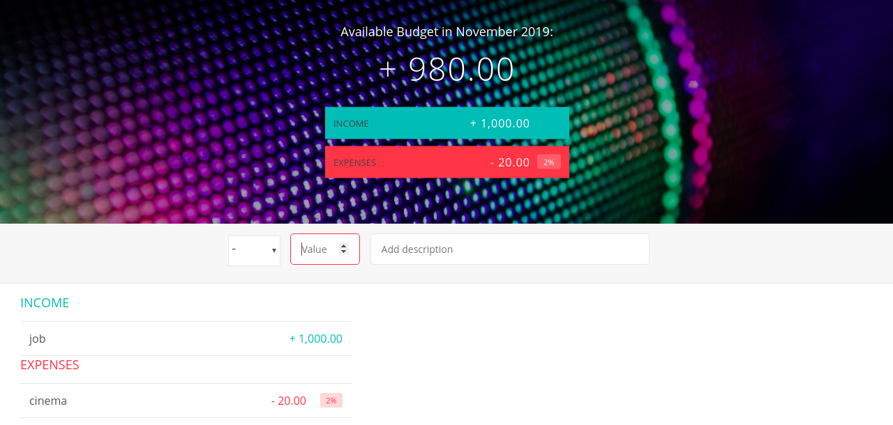

# Budgety:
As its name indicates, is a simple application web to help with the keeping track of your expenditures and incomes. Its responsive design will allow the user access from the laptop, the mobile phone and other devices without losing user comfort.
You can test the App in https://angelabenavente.github.io/Budgety/

Designed for practising JS and Responsive design.

## Guide to using the repository
You will need to install [Node.js](https://nodejs.org/) and [Gulp](https://gulpjs.com) to work with this repository, then:
1. Download or clone the repository.
2. Install local dependencies with `npm install`to install the necessary packages to convert Sass to CSS, minizarlo, etc.
3. Start the kit with `gulp`

> ### Every time we work with the code:
- From our terminal, we run the command `gulp` to perform the default task. The `gulpfile.js` will monitor our Sass, html and Javascript files and compile, minimize and/or reload the server every time we make a change.

## Gulp tasks included
###Start a web server for development
```
npm start
```
or what in this project is the same:

```
gulp
```
Launch a webserver with Browsersync and several watchers will keep an eye on SCSS/JS/HTML files in the **public/*folder to reload the browser when needed.

### Version ready to upload to production

To generate the files for production run:

```
npm run docs
```
or what in this project is the same:
```
gulp docs
```
In the **docs/** folder, minimized CSS and JS will be generated without sourcemaps ready to upload to the repo. Then upload them to the repo and activate in Github Pages the option **master/docs/*, so that Github Pages will serve the page from the folder **docs/*.

---

If you want to generate the production-ready files and also upload them to Github, run the following command:
```
npm run push-docs
```
This command deletes the **docs/*folder, re-generates it, creates a commit with the new files and makes a `git push.

